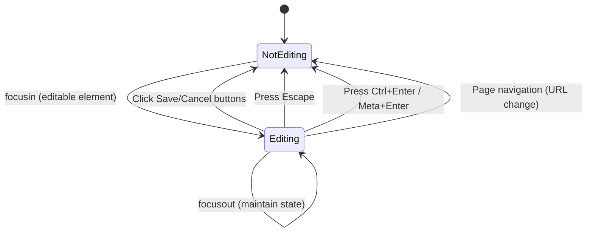

# Technical Specification: Issues-Solo

## 1.概要

JIRAの閲覧履歴をサイドパネルに一覧表示し、タブの生存確認、編集状態の検知、クイックジャンプを可能にするChrome拡張機能。外部ライブラリを一切使用せず、Vanilla JSで構築する。

## 2.構成要素 (Zero-Dependency)

- Manifest: V3
- Logic: Vanilla JavaScript (ES6+)
- UI: CSS Variables, Web Components (必要に応じて), HTML/CSS
- Storage: chrome.storage.local (設定・簡易履歴用) および IndexedDB (大量の履歴・キャッシュ用)

## 3.データ構造

- issueKey: string (e.g., "PROJ-123")
- title: string
- project: string
- lastAccessed: timestamp
- isOpened: boolean (現在タブとして存在するか)
- isEditing: boolean (コメント入力中か)
- tabId: number (生存中の場合)

## 4.主要機能のロジック

- 閲覧検知: chrome.tabs.onUpdated 等でJIRAのURLパターンを検知。
- 編集検知: 
    - content_script からJIRAの入力フィールドを監視。
    - 入力フィールドへのフォーカスで編集開始、保存・キャンセル操作（ボタンクリック、キー操作）で編集終了を検知する。
- 編集状態の遷移:

- タブ同期: 拡張機能の起動時およびタブ削除時に、chrome.tabs.query を使用してメモリ上の実在タブとDBの整合性を取る。

## 5. UI/UX

- サイドパネル内のスタイリングは標準CSSで行い、フレームワーク由来の脆弱性リスクをゼロにする。
- ステータス（編集中の鉛筆マーク、実在タブの点灯）をアイコンフォントを使わず、SVGまたはCSS drawingで表現する。
